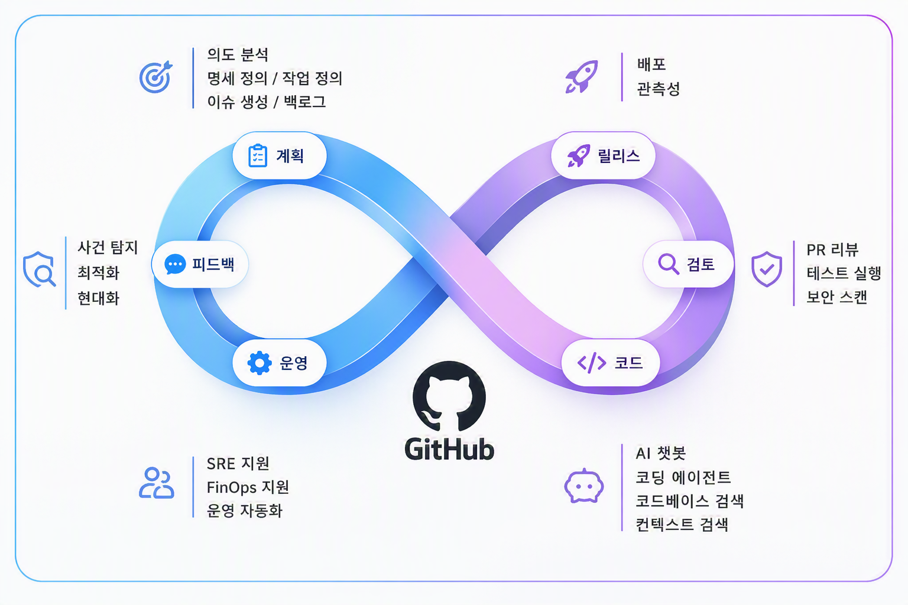
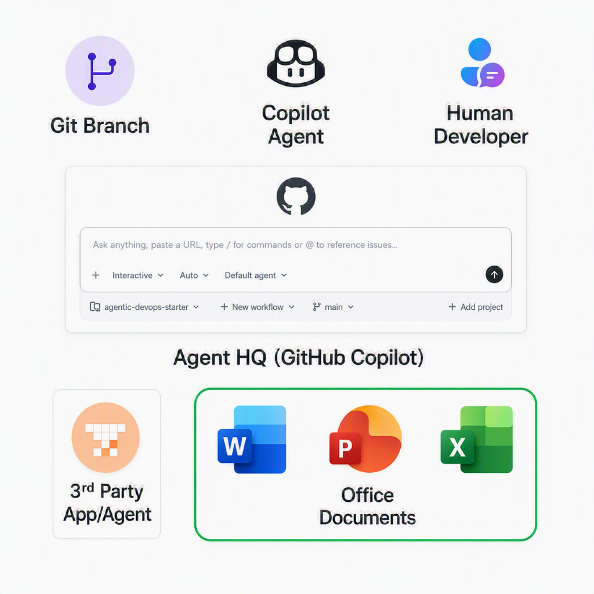
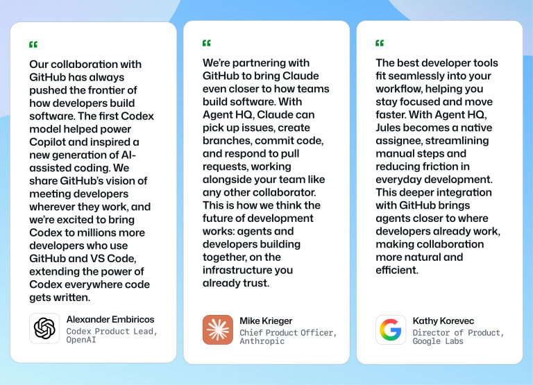
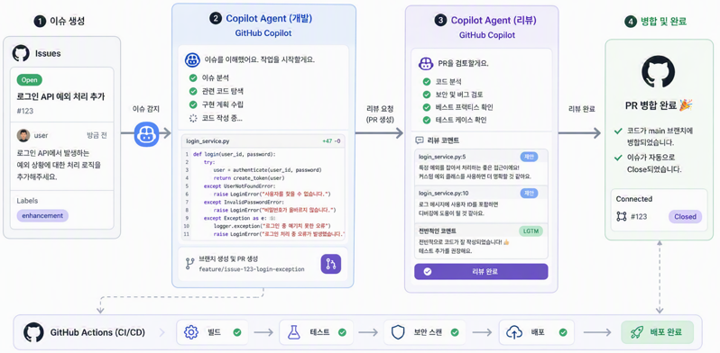
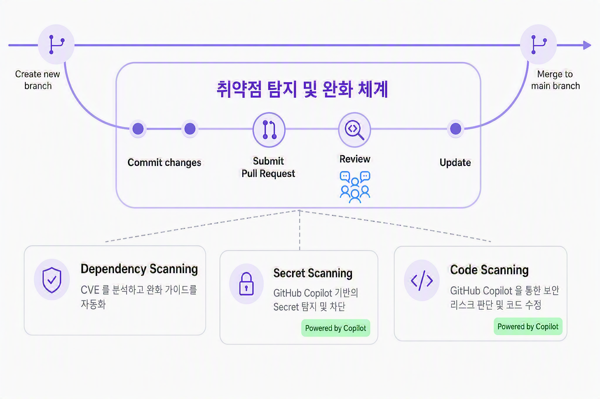
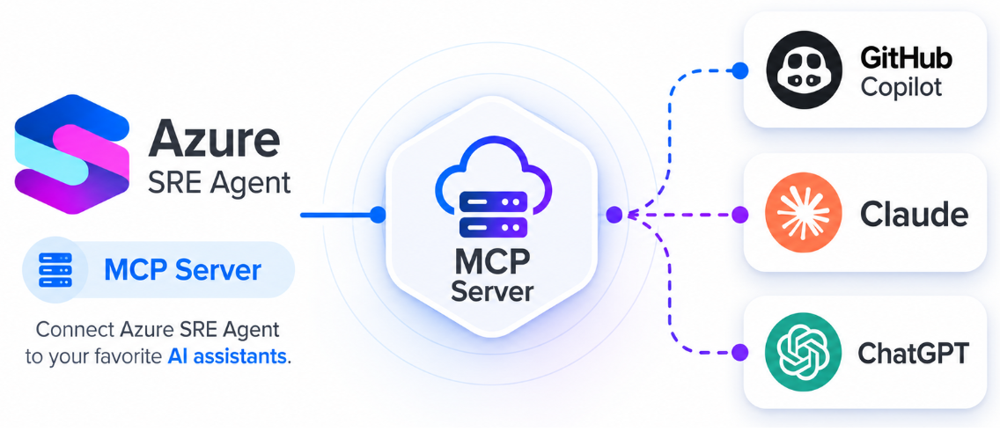
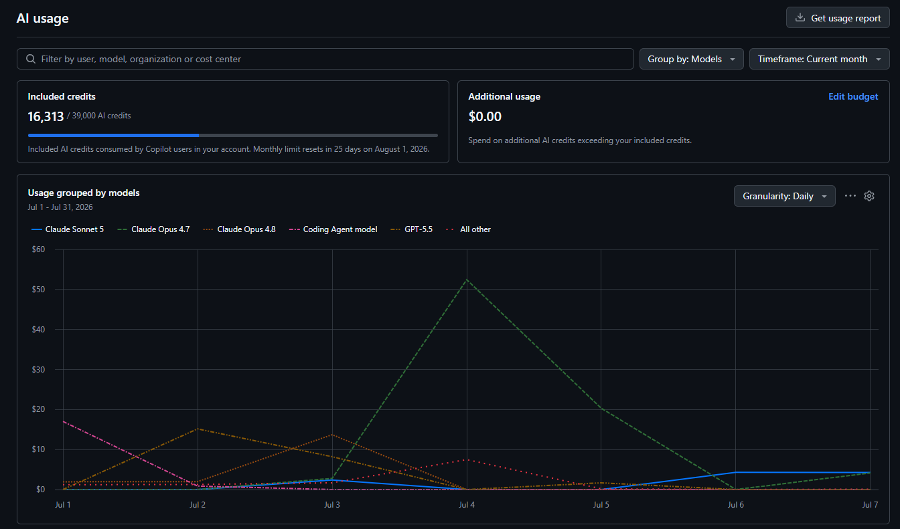
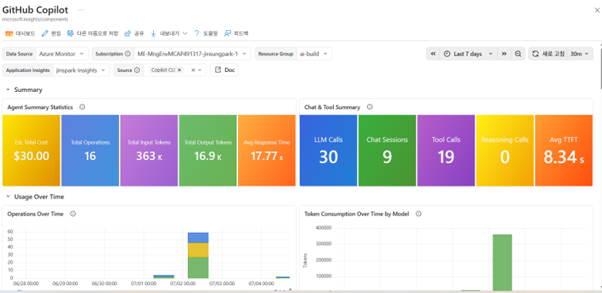

## AI 시대를 위한 개발 문화와 환경이란?

AI 가 산업 전반에 빠르게 정착하는 시점입니다. 이제는 AI 를 사업의 주요 의사결정에 전략적으로 활용하는 프론티어 기업(Frontier Firm)이라는 용어가 널리 쓰이고 있으며, 실제 AI 관련 업무 현장에서도 많은 기업이 프론티어 기업을 지향하는 흐름이 뚜렷합니다.

그 중에서도 가장 먼저 움직이고 있는 분야는 단연코 개발자 시장입니다. 엔지니어는 IT 기술 흐름에 민감하게 반응하는 직군이고, LLM 자체가 Coding 업무를 중심으로 발전해 온 점도 분명하기 때문입니다.

이번 블로그에서는 Frontier 기업들이 발 빠르게 도입하고 있는 AI-DLC 와, 이를 구현하기 위한 플랫폼인 Agentic DevOps 개발 문화와 환경에 대해 소개하고자 합니다.

## 왜 Agentic DevOps 인가?

Agentic DevOps 에 대해 설명하기 위해서는 AI-DLC 를 먼저 다뤄야 합니다. AI-DLC 는 Software Development Lifecycle 을 AI 중심으로 재설계하고자 하는 방법론입니다. AI 가 라이프사이클 전반에 기여할 수 있는 영역을 정의해 나가는 것이죠.
하지만 현 시점의 AI 는 기존의 방식 대비 많은 차이점이 있습니다. 더 잘하는 것도 있고, 더 못하는 종류의 작업들도 있습니다. 그 이유는 현 시점의 AI 가 확률론적(Stochastic)이기 때문입니다. 이 때문에 결정론적(Deterministic)인 기존의 시스템이 못하던 일들을 할 수 있지만, 반면에 환각(Hallucination)이 발생하기도 합니다.

Agentic DevOps 란 이러한 AI 의 특성을 반영한 형태의 DevSecOps 파이프라인입니다. AI-DLC 를 적용하기 위한 Agent 중심의 DevSecOps Platform 이라고 이해하시면 좋을 것 같습니다.

Agentic DevOps 는 AI-driven Software Development 를 위해 Software Lifecycle 을 Agent 중심으로 재설계하고, 개발자와 AI Agent 가 협업하는 방식을 정의합니다. 동시에 Security/Governance 를 내재화해 생산성을 향상하기 위한 플랫폼 체계를 지향합니다.

Agentic DevOps 는 이전의 DevOps, DevSecOps 와 같이 기술 스택 이상의 개발 문화를 포함합니다. AI-DLC 를 구현하기 위한 다양한 기술 스택이 존재하고, 이를 위한 개발자-에이전트 간의 올바른 협업 모델을 정의하는 것이죠.

#### 본 포스팅에서는 개발자들에게 친숙한 GitHub 기반으로 Agentic DevOps 기술 스택에 대해 알아보겠습니다.

## Agentic DevOps 구성 요소

### 계획 및 설계 (Plan & Design)

뭘 만들지를 정의하는 일은 개발자의 핵심 역량 중 하나입니다. 특히 바이브코딩이 활성화되면서 "무엇을 만들지" 계획하고 설계하는 능력이 정말 중요해졌습니다. 실제로 일부 회사들에서는 기획자들이 바이브코딩을 이용해서 빠르게 프로토타입을 만들고 이를 기반으로 엔지니어 리소스를 투입해 본격적으로 프로젝트를 런칭하는 형태를 만들어 나가고 있습니다.

이를 위해 정말 중요한 것은 에이전트의 개발 역량을 극대화할 수 있도록 올바른 컨텍스트를 주입하고, 명확한 스펙으로 작업을 시작하게 하는 것입니다.
AI 는 현시점에서 비즈니스 도메인에 대한 이해나 현실의 복잡한 컨텍스트를 직접 다루기 어렵기 때문에 올바른 도구와 생태계의 통합이 중요합니다.

Microsoft Copilot 중심의 생태계나 [GitHub 기반의 AgentHQ](https://github.blog/news-insights/company-news/welcome-home-agents/) 는 에이전트가 업무 컨텍스트를 이해하고 사람과 Interaction 하며 작업을 시작하는 데 효율적인 생태계입니다.

특히 [GitHub AgentHQ](https://github.blog/news-insights/company-news/welcome-home-agents/) 기능을 통해 AI 시대에 업무에서 자주 활용되는 도구인 Anthropic 의 Claude Code, OpenAI 의 Codex 와 같은 AI Agent 들을 통합 관리할 수 있습니다. 즉, 하나의 플랫폼에서 여러 에이전트를 연동해 사용할 수 있습니다.

또한 자주 사용되는 IDE 인 VS Code 나 GitHub Copilot App 의 Canvas Extension 등을 통해 사람이 업무에서 활용하는 Office 문서 등을 바로 에이전트에 주입시켜 활용할 수 있습니다.

### 개발 & 평가 (Development & Review)

Coding Agent 를 개발자가 활용해 함께 개발하는 바이브코딩은 산업 전반에 확산되어 가고 있는 단계입니다. 하지만 Frontier Firm 들은 바이브코딩 이후 Agentic Coding 에 대한 프랙티스를 적용해 보고 있습니다. Agentic Coding 이란 사람의 개입을 최소화한 형태의 개발 Process 를 말합니다. Interaction 환경에서는 하네스 엔지니어링(Harness Engineering)을 도입한 루프 엔지니어링(Loop Engineering)을 통해 자동화 형태로 이를 구현할 수 있습니다.

클라우드를 활용할 수 있는 환경이라면, [GitHub Enterprise Cloud 의 Cloud Agent](https://docs.github.com/en/copilot/how-tos/use-copilot-agents/cloud-agent) 와 같은 Remote Coding 이 실험되고 있습니다. 실제로 빅테크 기업에서 코드의 상당 비율을 AI 가 작성한다는 사례나, AI 가 작성하고 배포한 코드가 장애를 유발했다는 뉴스도 심심치 않게 접할 수 있습니다. Agentic Coding 은 아직 성숙화되고 있는 단계이며, 여러 기업이 사람이 업무를 지시하고 Agent 기반의 Coding / Evaluation Pipeline 이 지속적으로 운영되는 구조를 실험해 보고 있습니다.

GitHub Issue 기반으로 생성된 이슈들에 대해 Agent 가 추적해서 코드를 생성하고, Agent 기반으로 실제 리뷰도 가능합니다. Mission Critical 한 부분에 대해 Human In The Loop 을 통해 사람이 검증하고 배포하는 파이프라인을 구성합니다.

중요한 것은 클라우드에서 구동 시 비효율적인 업무들을 Agent 에 맡기고, 개발자 리소스 투입을 최소로 할 수 있다는 점입니다!

### 보안 (Security)

개발자에게 보안은 어렵지만 필수적인 요건입니다. 시스템 설계 뿐 아니라 특히 코드 레벨의 보안을 위한 Secure Coding 프랙티스는 굉장히 중요하죠. 이 때문에, DevOps 라는 문화를 넘어선 DevSecOps 문화와 파이프라인이 정착되었고, 많은 회사들이 규정을 준수하는 안전한 서비스를 제공하기 위해 DevSecOps 플랫폼을 구성하기 위해 노력하고 있습니다.

AI 가 발전하면서 Agentic DevOps 측면에서도 보안은 최우선순위입니다. 특히 놓치기 쉬운 Security Risk 검출이나 Secret 탐지와 같은 정적 분석은 많은 엔터프라이즈의 필수 요건 중 하나입니다.

보안리뷰는 AI 를 잘 활용할 수 있는 영역 중 하나입니다. OWASP, CVE 와 같은 잘 알려진 취약점에 대한 표준들이 잘 정의되어 있으며 AI 를 기반으로 오탐률(False Positive)을 낮추면서 정교한 스캐닝을 활용해 볼 수 있습니다.

[GitHub Advanced Security](https://github.com/security/advanced-security?locale=ko-kr) 의 경우 GitHub 의 플랫폼 위에서 제공되는 DevSecOps 를 위한 보안 도구이며, 단순한 보안 스캐닝 이상으로 Copilot Autofix 기능을 활용해서 Secure Coding Scanning 을 제공하고 있습니다.

사람 또는 에이전트가 코드를 작성한 뒤 파이프라인을 통해 올라오면, GitHub Advanced Security 를 통해 보안 취약점을 감지하고 완화 체계를 자동으로 유지할 수 있습니다.

### 운영 및 안정성 (Operation & Reliability)

Agentic Development 에서 사람의 역할이 여전히 중요한 이유 중 하나는 서비스의 안정성입니다. 특히 Mission Critical 한 어플리케이션들에 대해서는 여전히 100% Agent-driven 은 권장되지 않으며 사람의 개입(Human In The Loop)이 필수적입니다.

하지만 Service Reliability 를 위한 기술 스택은 많이 발전했고, AI-DLC 에서도 마찬가지입니다. Agent 는 장애 상황에서 엔지니어를 돕기 위한 서비스 분석, 서드파티 연동 기능을 제공하고 특히 Incident Report 와 같은 개발자에 대한 과중한 업무를 대신 처리해 줄 수 있습니다.

[Azure SRE Agent](https://learn.microsoft.com/en-us/azure/sre-agent/overview) 는 Azure 스택을 위해 안정성 판단 및 이슈 분석을 도와주는 에이전트입니다. PagerDuty나 ServiceNow 와 같은 잘 알려진 서드파티 툴들을 통해 인시던트 채널 관리 및 장애 상황 대응에 도움을 줄 뿐 아니라, 단순한 Root Cause Analysis(RCA) 이상으로 Agent 기반의 Azure CLI 기능을 통해 Mitigation 을 제안할 수 있습니다.

Azure SRE Agent 의 경우 GitHub Copilot 뿐 아니라 Claude 나 ChatGPT 와 같이 업무에서 활용되는 에디터 안에서도 SRE Agent 를 활용해 보실 수 있습니다.

기본적인 운영 데이터 추적은 SRE Agent 가 담당하고, 사람은 에이전트가 제공한 정보를 바탕으로 의사결정에 집중할 수 있습니다. 중요한 것은 Mission Critical 한 부분에서는 여전히 엔지니어와 함께 운영하는 것이 바람직하며, MTTR(장애 복구 시간; Mean Time To Recover)을 최소화하기 위해 팀 차원의 Agentic Reliability Practice 를 만드는 데 활용할 수 있다는 점입니다.

### 비용 관리 (FinOps)

토큰경제학(Tokenomics)이라는 말이 빠르게 확산되고 있습니다. AI-DLC 를 구축한다는 것은 자동화된 파이프라인에서 토큰을 소모하는 것과 마찬가지이며, 비용 관리가 필수적입니다.

토큰 사용량 최적화만으로도 여러 포스팅을 써야 할 만큼 방대한 주제라서 본 포스팅에서 길게 다루기는 어렵지만, Agentic DevOps 프랙티스를 만들 때 가장 중요한 토픽 중 하나라고 말씀드릴 수 있습니다.

이를 위해 중요한 것은 토큰 사용량에 대한 모니터링 및 감지 체계입니다. GitHub Copilot 을 사용하시는 경우, Billing 관리 페이지에서 AI Credit 사용량을 Cloud Agent 등 일반 사용자 시스템별로 추적할 수 있으며, Multi-Model Functionality 를 통해 잘 사용되는 모델 기준으로 정책을 정의해보실 수도 있습니다.

GitHub Copilot 외에 Claude Code 나 Codex 와 같은 Coding Agent 들을 활용하시더라도 Azure 를 사용하신다면 Application Insights 의 [Managed Grafana 대시보드](https://learn.microsoft.com/en-us/azure/managed-grafana/grafana-opentelemetry-app-insights)를 이용해 보실 수 있습니다. 인프라를 추가로 호스팅하는 대신 OpenTelemetry 기반으로 로깅 설정만 추가해 주면 Coding Agent 들에 대해 이미 구성된 관리형 대시보드를 제공받으실 수 있습니다.

## 마치며

본 포스팅에서는 AI-DLC 구축을 위한 Agentic DevOps 의 개념과 관련 기술 스택을 소개했습니다.

개념 위주로 정리를 했지만, 본문에 나와 있는 것처럼 Agentic DevOps 는 하나의 기술이나 플랫폼이 아닌 AI 와 개발자 협업을 위한 문화로 접근하는 것이 바람직합니다. 

관련해서는 추가 포스팅을 할 예정이기 때문에 포스팅이 도움되었다면 많은 관심 가져주시기를 바랍니다. :) 

### 참고자료

- GitHub AgentHQ : https://github.blog/news-insights/company-news/welcome-home-agents/
- GitHub CloudAgent : https://docs.github.com/en/copilot/how-tos/use-copilot-agents/cloud-agent
- GitHub Advanced Security : https://github.com/security/advanced-security?locale=ko-kr
- Managed Grafana : https://learn.microsoft.com/en-us/azure/managed-grafana/grafana-opentelemetry-app-insights
- Azure SRE Agent : https://learn.microsoft.com/en-us/azure/sre-agent/overview

-------
