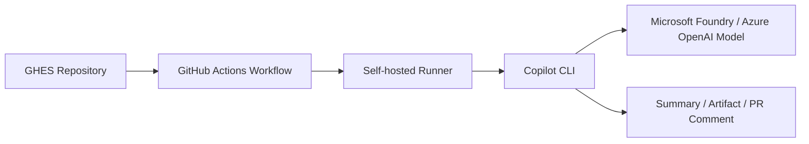

최근 금융권 등 폐쇄망 또는 제한된 네트워크 환경에서 AI 기반 코드 어시스턴트를 활용하고자 하는 니즈가 증가하고 있습니다. 특히 개발자가 기존 터미널과 IDE 환경을 유지하면서도, 조직이 통제하는 모델 엔드포인트와 네트워크 정책 안에서 코드 생성, 명령어 작성, 오류 분석을 수행할 수 있는 구성이 중요해지고 있습니다.

본 포스팅은 제한된 네트워크 환경에서의 AI 개발 자동화 구성을 다루는 시리즈 중 하나입니다. 아래 시리즈 목차를 통해 각 글을 순서대로 확인할 수 있습니다.

### 시리즈 목차

1. [제한된 네트워크 환경에서 구성하는 AI 기반 개발환경](/ai-development-environment-in-priave-network/)
2. [제한된 네트워크 환경에서 Agent와 Skill로 확장하는 AI 개발 자동화](/agentic-workflow-harness-engineering-with-copilot-agents-skills/)
3. **GitHub Enterprise Server에서 자율형 에이전트 구현**


GitHub Enterprise Server(GHES)를 사용하는 엔터프라이즈 환경에서는 GitHub.com의 managed cloud agent 기능을 그대로 사용할 수 없거나, 내부망 정책상 외부 managed execution 환경을 사용하기 어려운 경우가 많습니다. 이런 경우 GHES에 연결된 self-hosted runner에서 GitHub Copilot CLI를 실행하면, 완전한 cloud agent는 아니지만 이슈 분석, 코드 변경안 생성, 로그 요약, 배포 스크립트 점검과 같은 일부 agentic workflow를 내부 실행 환경에서 구성할 수 있습니다.

이 포스팅에서는 GHES self-hosted runner에서 `copilot` 명령어를 실행하고, Microsoft Foundry 또는 Azure OpenAI 모델을 직접 호출하도록 환경변수를 구성하는 방법을 설명합니다. 목표는 GitHub Actions workflow 안에서 Copilot CLI를 자동 실행하여 cloud agent와 유사한 반복 작업 자동화 패턴을 만드는 것입니다.

## 구성 목표와 한계

이 구성은 GitHub Copilot Cloud Agent와 동일한 제품 기능을 대체하는 것은 아니지만, 제한된 네트워크 구성 환경에서는 꽤 괜찮은 옵션이 될 수 있습니다. Cloud Agent는 이슈 할당, 작업 계획, 코드 수정, PR 생성, 리뷰 반영 같은 과정을 managed service로 오케스트레이션합니다. 반면 GHES runner 기반 구성은 GitHub Actions workflow가 트리거되고, runner 내부에서 `copilot` 명령어를 실행한 뒤 결과를 artifact, job summary, PR comment, 또는 후속 스크립트로 연결하는 방식입니다.

따라서 이 구성은 다음과 같은 시나리오에 적합합니다.

- GHES 환경에서 외부 Copilot Cloud Agent를 직접 사용할 수 없는 경우
- 내부망 runner에서 코드와 로그를 분석해야 하는 경우
- Microsoft Foundry 또는 Azure OpenAI 모델을 조직이 통제하는 엔드포인트로 호출해야 하는 경우
- API Key 또는 Microsoft Entra ID Bearer Token 기반으로 모델 호출 인증을 제어해야 하는 경우
- 사람의 승인 또는 PR 리뷰를 전제로 코드 변경 제안을 자동 생성하고 싶은 경우

반대로, 이 방식만으로 Copilot Cloud Agent 수준의 완전한 자율 작업자 경험이 제공되는 것은 아닙니다. 작업 범위 정의, 변경 파일 검증, 커밋/PR 생성, 보안 검사, 승인 절차는 별도 workflow와 정책으로 설계해야 합니다.

## 아키텍처 개요

전체 흐름은 다음과 같습니다.

1. GHES 저장소에서 GitHub Actions workflow가 실행됩니다.
2. Workflow는 GHES에 등록된 self-hosted runner에서 실행됩니다.
3. Runner는 소스 코드를 checkout하고 필요한 컨텍스트를 수집합니다.
4. Runner에 설치된 Copilot CLI가 `copilot` 명령어로 실행됩니다.
5. Copilot CLI는 환경변수에 설정된 Microsoft Foundry 또는 Azure OpenAI 엔드포인트를 호출합니다.
6. 결과는 job summary, artifact, 로그 파일, PR comment, 또는 후속 스크립트 입력으로 저장됩니다.



핵심은 runner가 GHES와 모델 엔드포인트 양쪽에 접근할 수 있어야 한다는 점입니다. 제한된 네트워크 환경에서는 GHES, Microsoft Foundry 엔드포인트, 인증 엔드포인트, DNS, 프록시, 방화벽 정책을 함께 확인해야 합니다.

## Runner 사전 준비

GHES self-hosted runner에는 다음 구성이 필요합니다.

- GHES 저장소 또는 조직에 등록된 self-hosted runner
- Runner에서 사용할 `copilot` CLI
- Git 또는 GHES 저장소 접근 권한
- Microsoft Foundry 또는 Azure OpenAI 엔드포인트 접근 경로
- API Key 또는 Microsoft Entra ID Bearer Token 발급 방식
- 로그와 생성 결과를 저장할 작업 디렉터리

Runner는 일반적으로 서비스 계정으로 실행됩니다. 따라서 대화형 로그인에 의존하기보다, workflow secret, runner host 환경변수, managed identity, workload identity, 또는 사내 secret manager를 통해 필요한 값을 주입하는 방식이 더 적합합니다.

## Copilot CLI 환경변수 구성

Copilot CLI가 Microsoft Foundry 또는 Azure OpenAI 모델을 직접 호출하기 위한 환경변수와 인증 방식은 이전 글인 [제한된 네트워크 환경에서 구성하는 AI 기반 개발환경](/ai-development-environment-in-priave-network/)의 `GitHub Copilot CLI 실행을 위한 환경변수 구성` 섹션을 참고하면 됩니다.

Runner 기반 구성에서 추가로 중요한 점은 환경변수를 어디에서 주입하느냐입니다. 개발자 로컬 터미널에서는 `export`로 직접 설정할 수 있지만, GHES self-hosted runner에서는 다음 방식 중 하나를 사용해야 합니다.

- GHES Actions secret으로 `COPILOT_PROVIDER_BASE_URL`, `COPILOT_MODEL`, `COPILOT_PROVIDER_API_KEY` 등의 값을 주입
- runner host의 서비스 환경변수 또는 OS secret store에서 주입
- Microsoft Entra ID Bearer Token을 사용할 경우 runner에서 비대화형 토큰 발급 흐름을 구성
- 민감정보가 workflow 로그에 출력되지 않도록 secret masking과 artifact 보존 정책을 함께 설정

아래 workflow 예시는 API Key 기반 BYOK 방식을 기준으로 필요한 값을 GHES Actions secret에서 읽어 `GITHUB_ENV`에 주입하는 패턴입니다. Entra ID Bearer Token 방식을 사용할 경우에는 `COPILOT_PROVIDER_API_KEY` 대신 `COPILOT_PROVIDER_BEARER_TOKEN`을 발급해 주입하면 됩니다.

> **Note** 기본적으로 GitHub Copilot CLI가 지원하는 GitHub Enterprise 환경은 GitHub.com 및 GitHub Enterprise Cloud입니다. GitHub Enterprise Server(GHES)는 기본 지원 대상이 아니므로, GHES runner에서 Copilot CLI를 사용할 때는 “GitHub 인증 토큰”과 “모델 provider 인증 토큰”의 역할을 분리해서 이해해야 합니다.
>
> | 토큰/환경변수 | 주 사용 대상 | 역할 |
> | --- | --- | --- |
> | `GITHUB_TOKEN` | GitHub Actions workflow | Workflow 실행 시 GitHub가 자동으로 발급하는 저장소 범위 토큰입니다. Checkout, artifact, PR comment, issue comment 등 GitHub API 작업에 사용합니다. Copilot CLI가 모델을 호출하기 위한 토큰은 아닙니다. |
> | `GH_TOKEN` | GitHub CLI(`gh`) 또는 GitHub API 호출 스크립트 | Runner에서 `gh` 명령어를 사용해 issue, PR, comment, release 같은 GitHub 작업을 수행할 때 사용합니다. 일반적으로 PAT 또는 GitHub App token을 주입합니다. Copilot CLI provider 인증과는 별개입니다. |
> | `COPILOT_GITHUB_TOKEN` | Copilot CLI의 GitHub 서비스 인증 | GitHub.com 또는 GitHub Enterprise Cloud의 Copilot 서비스와 통신할 때 사용할 수 있는 GitHub 인증 토큰입니다. GHES 환경에서 Microsoft Foundry 모델을 `COPILOT_OFFLINE=true`로 직접 호출하는 구성에서는 핵심 provider 인증 토큰이 아닙니다. |
>
> 정리하면, `GITHUB_TOKEN`과 `GH_TOKEN`은 GHES 저장소나 PR에 접근하기 위한 GitHub API 토큰이고, `COPILOT_PROVIDER_API_KEY`와 `COPILOT_PROVIDER_BEARER_TOKEN`은 모델 엔드포인트를 호출하기 위한 provider 인증 정보입니다. `COPILOT_GITHUB_TOKEN` 변수는 GitHub Enterprise Cloud에서 GitHub Copilot 서비스 인증을 위해 사용하는 변수이고, 이 구성에서는 모델 Provider 인증을 사용하므로 해당 변수는 사용되지 않습니다.

## Workflow 예시

### 1) 코드 변경 영향 분석

다음 예시는 PR 또는 수동 실행 시 self-hosted runner에서 Copilot CLI를 실행해 변경 영향 분석 결과를 생성하는 패턴입니다. 실제 GHES 버전과 Actions 설정에 따라 event, permission, secret 이름은 조정해야 합니다.


```yaml
name: Copilot CLI Impact Analysis

on:
  workflow_dispatch:
  pull_request:
    types: [opened, synchronize, reopened]

jobs:
  analyze:
    runs-on: [self-hosted, copilot-cli]

    steps:
      - name: Checkout repository
        uses: actions/checkout@v4

      - name: Configure Copilot CLI provider
        shell: bash
        env:
          COPILOT_PROVIDER_TYPE: azure
          COPILOT_PROVIDER_BASE_URL: ${{ secrets.COPILOT_PROVIDER_BASE_URL }}
          COPILOT_OFFLINE: "true"
          COPILOT_MODEL: ${{ secrets.COPILOT_MODEL }}
          COPILOT_PROVIDER_AZURE_API_VERSION: ${{ secrets.COPILOT_PROVIDER_AZURE_API_VERSION }}
          COPILOT_PROVIDER_WIRE_API: responses
          COPILOT_PROVIDER_API_KEY: ${{ secrets.COPILOT_PROVIDER_API_KEY }}
        run: |
          {
            echo "COPILOT_PROVIDER_TYPE=$COPILOT_PROVIDER_TYPE"
            echo "COPILOT_PROVIDER_BASE_URL=$COPILOT_PROVIDER_BASE_URL"
            echo "COPILOT_OFFLINE=$COPILOT_OFFLINE"
            echo "COPILOT_MODEL=$COPILOT_MODEL"
            echo "COPILOT_PROVIDER_AZURE_API_VERSION=$COPILOT_PROVIDER_AZURE_API_VERSION"
            echo "COPILOT_PROVIDER_WIRE_API=$COPILOT_PROVIDER_WIRE_API"
            echo "COPILOT_PROVIDER_API_KEY=$COPILOT_PROVIDER_API_KEY"
          } >> "$GITHUB_ENV"

      - name: Collect change context
        shell: bash
        run: |
          git fetch --no-tags --depth=50 origin "$GITHUB_BASE_REF" || true
          git diff --stat "origin/$GITHUB_BASE_REF"...HEAD > change-summary.txt || git diff --stat > change-summary.txt
          git diff "origin/$GITHUB_BASE_REF"...HEAD > change.diff || git diff > change.diff

      - name: Run Copilot CLI analysis
        shell: bash
        run: |
          copilot "다음 변경사항을 검토하고 영향 범위, 위험 요소, 추가 테스트가 필요한 부분을 한국어로 정리해줘. change-summary.txt와 change.diff 내용을 기준으로 답변해줘." \
            < change.diff \
            > copilot-analysis.md

      - name: Add analysis to job summary
        shell: bash
        run: |
          cat copilot-analysis.md >> "$GITHUB_STEP_SUMMARY"

      - name: Upload analysis artifact
        uses: actions/upload-artifact@v4
        with:
          name: copilot-analysis
          path: |
            change-summary.txt
            copilot-analysis.md
```


이 예시는 PR comment를 자동 작성하지 않고 job summary와 artifact에 결과를 남깁니다. 금융권이나 내부통제가 강한 환경에서는 모델 출력이 바로 PR에 반영되기보다, 사람이 검토한 뒤 comment나 코드 변경으로 연결하는 방식이 더 안전합니다.

### 2) Copilot Cloud Agent와 유사한 자율형 에이전트를 위한 작업 단위 생성

자율형 에이전트용 workflow는 작업 단위로 분리하는 것이 좋습니다. 예를 들어 다음과 같은 workflow를 구성할 수 있습니다.

| 작업 유형 | Trigger | Copilot CLI 역할 | 결과물 |
| --- | --- | --- | --- |
| 변경 영향 분석 | `pull_request` | diff 분석, 위험 요소 요약 | job summary, artifact |
| 테스트 실패 분석 | `workflow_run` 또는 수동 실행 | 실패 로그 요약, 원인 후보 제안 | issue comment, artifact |
| 보안 점검 보조 | `workflow_dispatch` | 특정 파일 또는 diff 기준 보안 검토 | markdown report |
| 배포 스크립트 리뷰 | `pull_request` | shell, Bicep, Terraform 변경 검토 | review checklist |
| 문서 초안 생성 | `workflow_dispatch` | 변경사항 기반 release note 또는 운영 문서 초안 생성 | artifact, PR comment |

중요한 점은 Copilot CLI가 “분석과 제안”을 수행하고, 실제 코드 반영이나 배포는 별도 승인 단계를 거치게 하는 것입니다. 이렇게 하면 Copilot Cloud Agent와 비슷한 자동화 경험을 만들면서도 내부통제와 감사 요구사항을 유지할 수 있습니다.

## Runner 운영 시 고려사항

GHES runner에서 Copilot CLI를 운영할 때는 다음 항목을 함께 검토해야 합니다.

- **권한 범위 최소화**: Runner 서비스 계정과 workflow token 권한을 필요한 범위로 제한합니다.
- **Secret 관리**: API Key, Bearer Token, model endpoint는 workflow 파일에 직접 저장하지 않습니다.
- **출력 검증**: Copilot CLI 결과를 자동 커밋하거나 자동 배포하지 않고, 리뷰와 승인 단계를 둡니다.
- **로그 마스킹**: 환경변수와 모델 응답에 민감정보가 포함되지 않도록 로그 마스킹과 artifact 보존 정책을 설정합니다.
- **네트워크 경로 검증**: GHES, runner, Microsoft Foundry 엔드포인트, 인증 엔드포인트 사이의 경로를 문서화합니다.
- **모델 데이터 처리 기준**: 프롬프트와 응답 데이터가 어느 리전에서 처리되는지, 저장 여부와 보존 기간을 확인합니다.
- **Runner 격리**: 프로젝트별 또는 민감도별 runner pool을 분리해 코드와 secret 접근 범위를 통제합니다.

특히 에이전트 자동화로 발전시킬수록 runner 권한이 커질 수 있습니다. 따라서 “AI가 제안하고 사람이 승인한다”는 기본 흐름을 유지하는 것이 안전할 수 있습니다.

## 마치며

GHES self-hosted runner에서 Copilot CLI를 실행하면 Copilot Cloud Agent를 그대로 대체하지는 못하지만, 제한된 네트워크 환경에서도 AI 기반 분석과 제안 자동화를 구성할 수 있습니다. 핵심은 Copilot CLI를 독립적인 agent로 과대해석하기보다, GitHub Actions workflow 안에서 특정 작업을 수행하는 자동화 도구로 사용하는 것입니다.

정리하면 다음과 같습니다.

1. GHES runner는 내부망에서 실행되는 제어 가능한 자동화 실행 환경입니다.
2. Copilot CLI는 runner 안에서 모델 호출과 자연어 기반 분석을 수행할 수 있습니다.
3. Microsoft Foundry 또는 Azure OpenAI 모델을 직접 호출하려면 `COPILOT_PROVIDER_*` 환경변수와 인증 방식을 명확히 구성해야 합니다.
4. Copilot Cloud Agent와 유사한 경험은 workflow trigger, context 수집, Copilot CLI 실행, 결과 저장, 사람의 승인 단계를 조합해 만듭니다.
5. 보안, 감사, secret 관리, 네트워크 경로, 모델 데이터 처리 기준은 별도 운영 설계가 필요합니다.

이 방식은 금융권이나 엔터프라이즈처럼 외부 managed agent 사용이 제한되는 환경에서, 내부 runner 기반으로 AI 개발 자동화를 점진적으로 검토하는 현실적인 출발점이 될 수 있습니다.

### 참고자료

- [GitHub Copilot CLI programmatic reference](https://docs.github.com/en/copilot/reference/copilot-cli-reference/cli-programmatic-reference)
- [Using your own LLM models in GitHub Copilot CLI](https://docs.github.com/en/copilot/how-tos/copilot-cli/customize-copilot/use-byok-models#connecting-to-azure-openai)
- [GitHub Actions self-hosted runners](https://docs.github.com/en/actions/hosting-your-own-runners)
- [Codex with Azure OpenAI in Microsoft Foundry Models](https://learn.microsoft.com/en-us/azure/foundry/openai/how-to/codex?tabs=npm)
