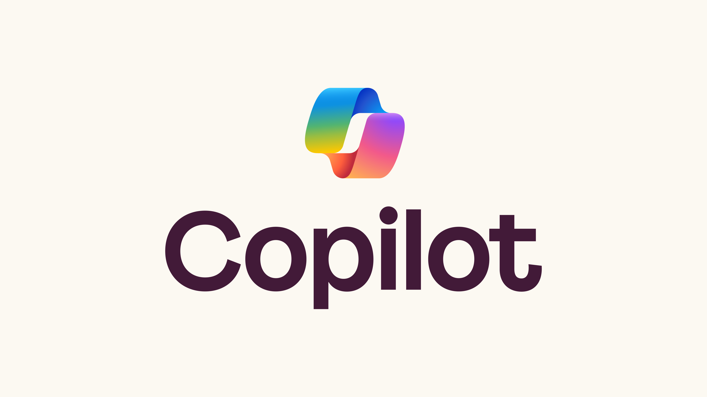
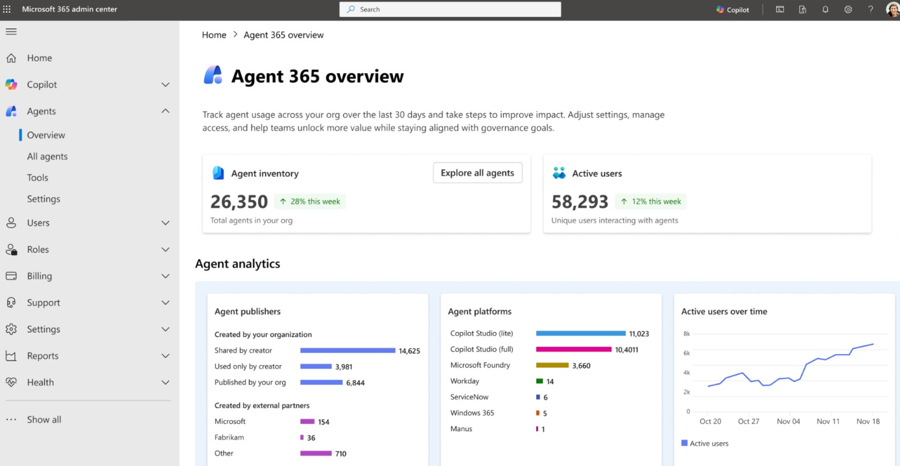
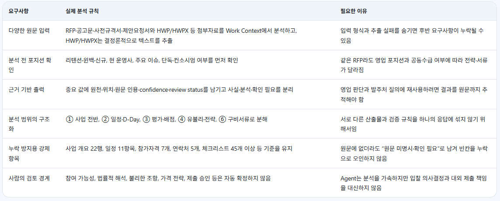
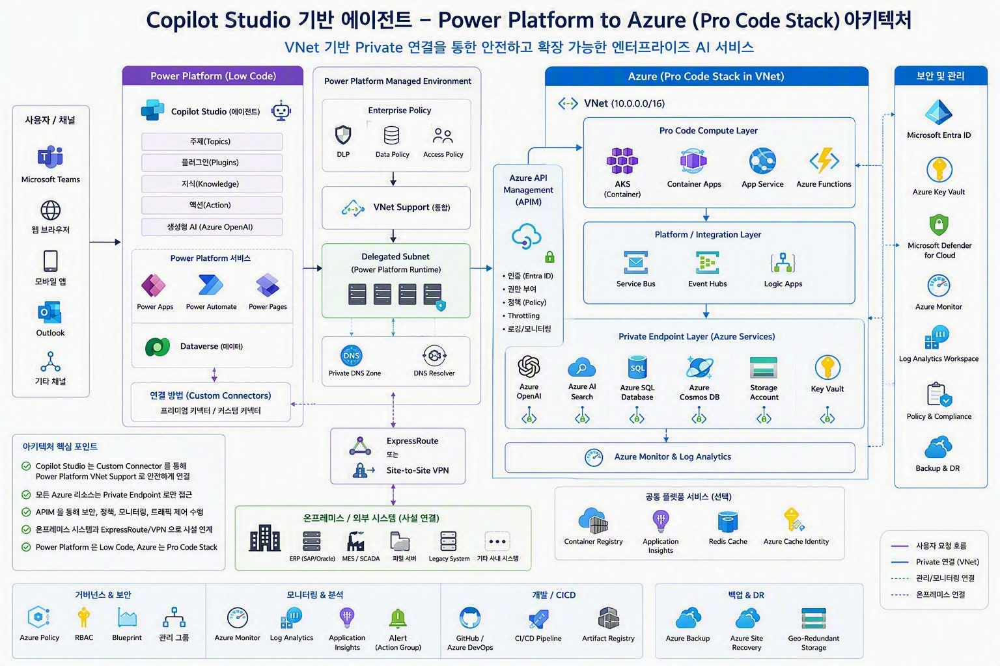
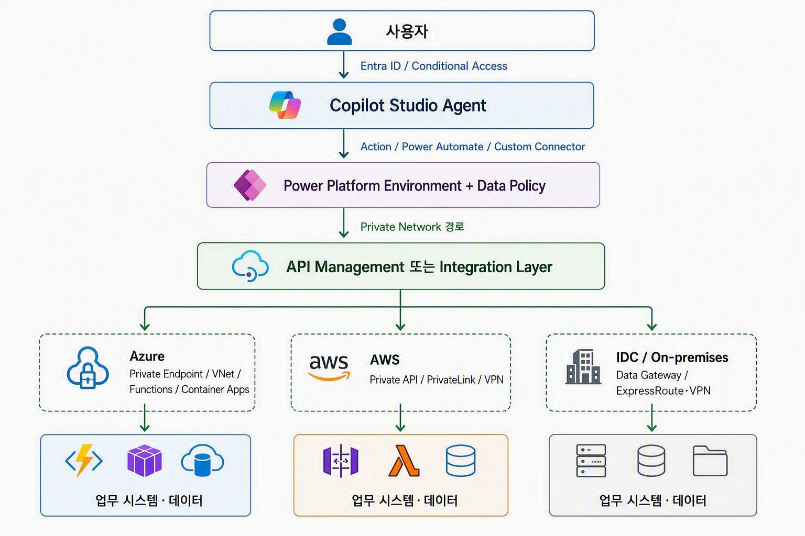

## 업무형 AI Agent 전환은 어디서 시작해야 할까?

AI Agent 를 업무에 적용하려는 시도는 이미 많은 조직에서 시작되고 있습니다. Microsoft 365 Copilot 을 도입해 개인 생산성을 높이거나, Copilot Studio 로 사내 업무 Agent 를 만들고, Power Platform 으로 승인과 프로세스를 자동화하는 사례가 빠르게 늘어나고 있습니다.

하지만 실제 프로젝트를 진행하다 보면 생각보다 자주 같은 질문을 만나게 됩니다. 어떤 업무부터 Agent 로 전환해야 하는지, Copilot 만 구매하면 모든 게 해결되는지, 아니면 여전히 개발이 필요한지, 사내 데이터와 권한은 어디까지 열어야 하는지, 운영과 보안 책임은 누가 가져가야 하는지와 같은 질문들입니다.

이번 블로그에서는 실고객사의 AI Transformation 구축을 지원하면서 정리한 업무형 AI Agent 를 설계하고 운영하기 위한 General Solution Guide 를 소개하고자 합니다. 핵심은 단순히 모델이나 제품을 선택하는 것이 아니라, 업무·데이터·권한·운영을 하나의 서비스로 설계하는 것입니다.

이 글에서는 Microsoft 365 Copilot, Copilot Studio, Power Platform, Cowork, 그리고 Azure 기반 Pro-Code 확장을 함께 고려하는 방식으로 AX Transformation 의 설계 기준을 정리합니다.

## 왜 AX Transformation 인가?

많은 기업이 AI Agent 를 검토할 때 먼저 제품 이름부터 고르는 경우가 많습니다. Microsoft 365 Copilot 을 쓸지, Copilot Studio 로 Agent 를 만들지, 아니면 Azure AI 와 자체 개발 코드로 구성할지를 먼저 정하려는 것이죠.

특히 기업 업무에서는 단순한 답변 품질만으로 충분하지 않습니다. 실제 업무 데이터는 권한과 민감도를 가지고 있고, 결과는 메일 발송·승인·계약·재무 영향과 연결될 수 있습니다. 따라서 AI Agent 는 "재미있는 데모"가 아니라 "운영 가능한 업무 서비스"로 설계되어야 합니다.

AX Transformation 은 이런 관점에서 AI Agent 를 도입하는 접근입니다. 업무 가치는 빠르게 검증하되, 보안·거버넌스·운영은 처음부터 Production 기준으로 설계하는 것이 중요합니다.

## 문제 정의: 무엇을 자동화할까보다 어떤 결과를 개선할까

Agent 를 만들기 전에 가장 먼저 해야 할 일은 업무를 정확히 정의하는 것입니다. 단순히 "문서를 요약해 주세요"나 "메일을 자동으로 보내 주세요"와 같은 요청만으로는 충분하지 않습니다.

업무에는 보통 Trigger, 입력, 단계, 완료 조건, 예외 상황이 존재합니다. 같은 문서 분석 업무라도 단순 요약인지, 의사결정 보조인지, 외부 제출물 생성인지에 따라 필요한 통제와 검증 수준이 달라집니다.

이 단계에서는 다음과 같은 질문을 먼저 정리하는 것이 좋습니다.

- 업무 오너가 있고 결과의 책임자가 명확한가?
- 실제 데이터와 대표 예외 케이스를 확보했는가?
- 오류가 발생했을 때 비용과 영향이 어느 정도인가?
- 사람의 승인 경계와 자동화 금지 영역이 정의되어 있는가?
- MVP(Minimum Viable Product) 의 영역과 운영 영역을 알맞게 구분할 수 있는가?

업무형 Agent 는 "무엇을 자동화할까"보다 "어떤 결과를 안전하게 개선할까"에서 시작해야 합니다. 반복 업무, 판단 지점, 데이터 위치, 성공 지표를 정의한 뒤에야 적절한 플랫폼과 구현 패턴을 선택할 수 있습니다.

대표적인 업무 패턴은 크게 네 가지로 볼 수 있습니다.

첫 번째는 Knowledge Work 입니다. 문서 검색, 요약, 비교, 근거 추출처럼 사람이 정보를 찾고 정리하는 데 많은 시간을 쓰는 업무입니다. 두 번째는 Decision Support 입니다. 조건을 분석하고 추천하거나, 예외를 사람에게 이관하고, 승인 판단을 돕는 형태입니다. 세 번째는 Process Automation 입니다. 폼, 메일, Teams, 업무 시스템 사이의 흐름을 자동화하는 업무입니다. 마지막은 System Interaction 입니다. API, 커넥터, MCP 도구를 호출하고 결과를 기록하는 형태입니다.

이 네 가지 패턴 중 어디에 가까운지에 따라 Microsoft 365 Copilot, Agent Builder, Copilot Studio, Power Platform, Azure AI / Pro Code 의 선택이 달라집니다.

## 거버넌스와 보안은 개발을 막는 장치가 아니다

AI Agent 프로젝트에서 거버넌스는 개발을 막기 위한 규정처럼 보일 수 있습니다. 실제로 많은 AX 과제에서 에이전트를 만들었을 때 보안상 이유로 거절되는 경우가 많습니다.
하지만 실제로는 거버넌스와 보안은 승인된 데이터와 권한 안에서 Agent 를 반복 배포할 수 있게 하는 운영 시스템에 가깝습니다.

기본 원칙은 Zero Trust 와 동일합니다. 명시적으로 검증하고, 최소 권한을 적용하며, 침해를 가정해야 합니다. 그리고 이 원칙은 Agent 가 보는 데이터뿐 아니라 Agent 가 실행할 수 있는 도구, API, 업무 행위까지 포함해야 합니다.

업무형 Agent 의 거버넌스 모델에는 여러 역할이 필요합니다.

| 역할 | 주요 책임 |
| --- | --- |
| Business Owner | 업무 가치, 결과 책임, 자동화 허용 범위를 정의합니다. |
| Data Owner | 데이터 분류, 품질, 사용 목적, 접근 대상을 검토합니다. |
| Maker / Developer | 정책을 준수하는 설계, 테스트, 배포 패키지를 만듭니다. |
| Security / Privacy / Compliance | 위협 모델, 개인정보, DLP, 규제 준수, 잔여 위험을 검토합니다. |
| Platform Admin | 환경, 커넥터, 권한, 파이프라인, 모니터링을 운영합니다. |
| Service Owner | SLA, 지원, 비용, 변경, 장애 대응을 책임집니다. |

중요한 것은 Agent 의 위험 등급을 "어떤 모델을 쓰는가"가 아니라 "어떤 데이터에 접근하고 어떤 행위를 수행하는가"로 분류하는 것입니다.

위험 등급은 다음처럼 나누어 볼 수 있습니다.

| 위험 등급 | 대표 업무 | 필요한 통제 |
| --- | --- | --- |
| Low Risk | 공개 데이터 기반 요약, 초안 작성처럼 외부 실행이 없는 업무 | 기본 접근 제어, 사용 로그, 품질 검토 |
| Medium Risk | 내부 데이터 RAG, 업무 시스템 조회가 포함된 업무 | 권한 기반 검색, 민감도 라벨, 위협 모델, 회귀 평가 |
| High Risk | 개인·기밀정보 처리, 외부 전송, 쓰기·발송·승인·재무 영향이 있는 업무 | Human Approval, 거래 한도, 상세 감사, Red Team, Kill Switch |
| No-Go | 법적으로 금지되거나 통제 불가능한 완전 자율 행위 | 자동화 대상에서 제외 |

## AX 를 위한 보안 체계 운영하기

AI Agent 의 보안 체계는 한 번 승인하고 끝나는 방식이 아니라 수명주기 전체를 기준으로 운영되어야 합니다.

보안 체계는 다음 네 단계로 운영하는 것이 좋습니다.

| 단계 | 운영 포인트 |
| --- | --- |
| Discover | 조직 내 AI 자산과 Shadow AI 를 식별합니다. 어떤 Agent 가 있고, 어떤 모델·지식원·도구·MCP Server 를 사용하며, 소유자와 버전은 무엇인지 카탈로그화합니다. STRIDE 같은 기존 위협 모델링 방식에 MITRE ATLAS, OWASP GenAI 위험을 보완해 AI 특화 위험을 함께 봅니다. |
| Protect | Entra ID, Conditional Access, Managed Identity, 최소 권한을 적용합니다. Microsoft Purview 의 분류, 민감도, 보존, DLP 정책과 Power Platform Data Policy 를 함께 사용해 데이터 경계를 정의합니다. Private Endpoint, API Management, 허용목록, Rate Limit 등도 중요한 통제 수단입니다. |
| Detect | Prompt Injection, Jailbreak, 비정상 도구 호출, 민감정보 노출을 탐지합니다. 입력·출력 필터 결과, 도구 호출, 승인, 토큰과 비용, 실패 로그를 중앙에서 볼 수 있어야 합니다. |
| Respond & Improve | Agent 비활성화, 권한 회수, 커넥터 차단, 모델·프롬프트 롤백 절차를 준비합니다. 사고, 품질 저하, 정책 변경은 다시 평가 세트와 통제 정책에 환류되어야 합니다. |

이 구조가 있어야 Agent 를 한 번 만드는 데서 끝나지 않고, 지속적으로 개선하고 안전하게 확산할 수 있습니다.

## 플랫폼 선택: 관리형 경로를 우선하고 필요한 만큼만 Pro Code

솔루션을 설계할 때는 가장 관리 부담이 낮은 Microsoft 관리형 경로를 우선 선택하는 것이 좋습니다. SaaS/PaaS 우선, 계층 분리, 직접 데이터 접근 금지, 모델·도구 추상화를 기본 원칙으로 삼는 것이죠.

아래와 같이 옵션별 우선 적용 상황과 경계 조건을 나누면, "어떤 제품을 쓸 것인가"보다 "어떤 업무 경험과 통제가 필요한가"를 기준으로 선택할 수 있습니다.

| 옵션 | 우선 적용 상황 | 핵심 강점 | 경계·확인 사항 |
| --- | --- | --- | --- |
| Microsoft 365 Copilot | Word, Excel, Outlook, Teams 앱 내부에서 M365 데이터를 기반으로 개인 생산성, 검색·요약, 신규 문서 작성을 지원하는 경우 | 기존 사용자 경험, Microsoft Graph 와 M365 권한·보안·컴플라이언스 상속, 빠른 확산 | 범용 작업에 적합합니다. 특정 목적의 반복 시나리오, 사람의 관여 없는 이벤트 기반 자동 대응, 외부 시스템 연동이 필요하면 Agent Builder, Copilot Studio, Power Platform, Cowork 를 검토해야 합니다. M365 외부 데이터 조회나 MCP 연동은 Platform Admin 지원이 필요합니다. |
| Agent Builder / SharePoint Agent | M365 Copilot 에서 제공되는 지식과 승인된 SharePoint 지식원을 중심으로 팀·부서 Q&A, 탐색, 초안 작성을 빠르게 구성하는 경우 | 낮은 진입 장벽, 빠른 구축, M365 문맥 안의 배포 | 데이터 조회와 문서 작성 중심입니다. 복잡한 도구 호출, 다단계 승인, 이벤트 기반 자동화, 세밀한 ALM 이 필요하면 Copilot Studio 또는 Cowork 로 확장하는 것이 좋습니다. 외부 데이터 시스템 연동은 Platform Admin 의 지원과 정책 검토가 필요합니다. |
| Copilot Studio | 조직 공용 Agent, 다중 채널, 대화 흐름, Knowledge, Actions, 커넥터, 승인과 업무 자동화 시나리오를 부서 단위로 운영하거나 별도 인프라 구축 없이 AI Agent 를 구성하는 경우 | Low Code 오케스트레이션, M365·Power Platform 연계, 인증·채널·분석·DLP 통제 | 환경 전략, Data Policy, Connector 분류, Endpoint Filtering, Solution ALM, 용량과 메시지 비용을 사전에 설계해야 합니다. Low Code 에서 제공되지 않는 외부 스크립트, 패키지, 특수 런타임이 필요한지도 확인해야 합니다. |
| Power Platform | 폼, 업무 앱, 승인, 케이스 관리, Dataverse, 규칙 기반 프로세스가 중심이고 AI 가 일부 단계를 지원하는 경우 | 데이터·UI·Workflow·ALM 을 통합하고 현업과 IT 가 공동 개발하기 쉬움 | Power Apps 와 Dataverse 는 Agent 자체라기보다 사용자 인터페이스, 업무 상태 저장소, 프로세스 데이터 계층에 가깝습니다. Default 환경 의존, 환경 스프롤, 개인 Connection, 소유자 변경, Premium Connector 와 라이선스 리스크를 관리해야 합니다. |
| Cowork | 개인 또는 팀 업무에서 Skill 기반 자동화, 도구 호출, 장기 문서 처리, 문서 정리·생성, 이벤트 기반 응대를 코드 개발 없이 빠르게 구성하는 경우 | 시나리오 개발부터 실제 사용까지 별도 코드 개발 부담이 낮고, M365 Copilot 이 제공하지 못하는 장기 처리와 Skill Orchestration 에 유리함 | 특정 시나리오의 사용량이 커지거나 조직 공용 운영, 배포 승인, 중앙 거버넌스가 필요해지면 Copilot Studio 전환을 검토해야 합니다. 외부 데이터 시스템이나 MCP 연동은 Platform Admin 협조가 필요합니다. |
| Azure AI / Pro Code | 복잡한 RAG, Agentic RAG, 특수 인증, 대규모 API, 엄격한 네트워크, 고성능 요구, 재사용 플랫폼, Custom UX 가 필요한 경우 | 네트워크, 런타임, 모델, 데이터 처리, 도구 실행을 세밀하게 제어할 수 있음 | 개발, 보안, SRE, FinOps 책임이 증가합니다. 관리형 옵션으로 해결되지 않는 요구가 평가로 확인된 부분에만 추가하는 것이 바람직합니다. |

## 구현 패턴: Copilot, Workflow, Agentic

업무형 Agent 는 구현 패턴에 따라 통제 방식도 달라집니다.

Copilot Pattern 은 사용자가 최종 판단하고 Agent 는 검색, 요약, 초안, 추천을 제공하는 방식입니다. 지식 업무나 오류 비용이 중간 이하인 업무에 적합하고, M365 Copilot 에서 시작해 Agent Builder, 필요 시 Copilot Studio 로 확장하는 경로가 자연스럽습니다. Copilot Pattern 으로 구성 시 중요한 것은 Standard RAG 와 Workflow 로 충분한 업무를 처리할 수 있게 만드는 것입니다.

Workflow Pattern 은 다시 두 가지로 나누어 보는 것이 좋습니다.

첫 번째는 AI Agent 중심 Workflow 입니다. 정의되지 않은 다양한 사용자 요청과 업무 시나리오에 응대해야 하고, Agent 가 대화 맥락을 유지하면서 Knowledge, Action, Connector 를 선택해야 하는 경우입니다. 이 패턴은 Copilot Studio 가 잘 맞습니다. 부서 공용 Agent, 다중 채널, 승인 흐름, 업무 시스템 연계, 운영 분석이 필요한 경우 Copilot Studio 를 중심으로 구성하고, 필요한 부분만 Power Automate 나 Custom Connector 로 연결합니다.

두 번째는 단일 작업 중심 Workflow 입니다. 단계와 분기가 비교적 예측 가능하고, AI 는 분류·추출·요약·작성 같은 특정 작업만 수행하는 경우입니다. 이 패턴은 Power Automate, AI Builder, RPA 를 활용해 기존 프로세스 안에 AI 기능을 삽입하는 방식이 적합합니다. 예를 들어 접수 문서에서 필드를 추출하거나, 메일 내용을 분류하거나, 승인 요청 초안을 만드는 작업은 Agent 전체를 만들기보다 Workflow 안의 한 단계로 AI 를 사용하는 편이 단순합니다.

이 관점에서 Power Apps 와 Dataverse 는 구현 패턴의 중심 Agent 라기보다 사용자 인터페이스와 업무 데이터 저장·상태 관리 계층으로 보는 것이 자연스럽습니다. 사용자는 Power Apps 에서 결과를 확인하고 수정할 수 있고, Dataverse 는 케이스, 승인 상태, 처리 이력, 참조 데이터를 보관하는 역할을 합니다.

Agentic Pattern 은 Agent 가 계획하고 여러 지식원과 도구를 선택해 반복 실행하는 방식입니다. 동적 소스 선택, 다단계 추론, 복합 업무에 유리하지만 자율성이 높아질수록 통제도 강해져야 합니다. Copilot Studio 또는 Azure AI / Pro Code 를 사용하거나 Copilot Cowork 등을 통한 Agent Skill 의 활용을 고려할 수 있습니다.

## 조직 확산을 위한 체크리스트

여기까지의 내용을 조직 전체로 확산하기 위해서는 단순히 좋은 Agent 를 몇 개 만드는 것만으로는 부족합니다. 업무 오너, 데이터 권한, 보안 정책, 개발 방식, 운영 체계가 함께 준비되어야 같은 패턴을 여러 부서와 Use Case 로 반복 적용할 수 있습니다.

먼저 아래 항목을 기준으로 준비 상태를 점검하는 것이 좋습니다.

| 관점 | 점검 항목 |
| --- | --- |
| Problem & Value | 업무 오너와 결과 책임자를 지정합니다. As-Is / To-Be 업무 흐름, Baseline, KPI, 사람 승인 경계, 자동화 금지 영역을 정의합니다. 누가 Agent 를 만들 수 있고, 만들어진 Agent 를 어떻게 운영할지도 명확히 해야 합니다. |
| Governance & Security | Agent 카탈로그, 소유자, 위험 등급, 지원 채널을 등록합니다. Entra ID 기반 인증, 최소 권한, DLP, 민감도 라벨, 보존 정책을 적용하고, 커넥터·MCP·API 호출에 대한 허용목록, 감사 로그, Rate Limit 을 준비합니다. Dev / Test / Production 환경을 분리하고, Production 배포에는 명확한 승인자를 둡니다. |
| Solution & ALM | Low Code 로 빠르게 검증하되, Pro Code 가 필요한 이유는 ADR(Architecture Decision Record) 형태로 남깁니다. Copilot Studio, Power Platform Solution, Pipeline, 소스 관리, 버전, 롤백 기준을 운영하고, Prompt, Knowledge Source, Tool Schema, Flow 변경도 배포 가능한 자산으로 관리합니다. 정상 케이스뿐 아니라 예외, 답변 불가, 권한 차이, 민감정보, 악의적 입력, 장애, 비용 시나리오를 포함한 평가 세트도 필요합니다. |
| Operation & Scale | 운영 Runbook, SLA 또는 SLO, 장애 대응, 비용 관리, 보안 이벤트 대응 절차를 준비합니다. 사용량, 품질, 안전, 비용 지표를 정기적으로 보고하고, 사용하지 않는 Agent, 환경, 커넥터, MCP Tool 을 정리합니다. 소유자 변경, 조직 개편, 라이선스 변경, 모델 변경 같은 현실적인 운영 이벤트에도 대응할 수 있어야 합니다. |
| Adoption | 사용자 교육과 피드백 루프를 설계합니다. 어떤 업무에서 사용해야 하는지, 결과를 어떻게 검증해야 하는지, 오류나 개선 요청은 어디로 전달해야 하는지 안내합니다. 잘 동작하는 Agent 는 템플릿과 공통 Skill, 공통 Tool 로 재사용하고, 실패한 Agent 는 원인을 학습해 다음 Use Case 의 기준으로 삼습니다. |

위와 같은 기능 지원을 위해 Microsoft 환경 위에서는 Agent365 를 이용해보실 수 있습니다.

Agent365 는 조직 안에서 생성·배포·운영되는 AI Agent 를 하나의 관리 대상으로 다루기 위한 Microsoft 의 Agent 운영 계층으로 이해할 수 있습니다.

개별 사용자가 만든 Agent 나 부서 단위로 배포된 업무 Agent 를 카탈로그화하고, 소유자·권한·사용량·정책·보안 상태를 함께 관리함으로써 Agent 가 늘어날수록 발생하는 Shadow AI, 중복 개발, 과다 권한, 운영 책임 부재 문제를 줄이는 데 초점을 둡니다. 따라서 Agent365 는 Copilot 과 Copilot Studio 로 Agent 를 만드는 영역을 넘어, 조직 전체에서 Agent 를 안전하게 발견하고 통제하며 확산시키기 위한 거버넌스 기반으로 활용할 수 있습니다.

## Reference Architecture: RFP 분석 자동화 Agent

업무형 Agent 의 예시로 RFP 분석 자동화 Agent 를 생각해 볼 수 있습니다. RFP 문서 분석 에이전트는 전 세계적으로 많은 수작업을 대체할 수 있는 대표적인 Use Case 입니다. 이 Agent 의 목적은 RFP 문서를 읽고 끝나는 단순 요약이 아니라, 사업·일정·평가·전략·구비서류 분석을 근거 기반 산출물로 연결하는 것입니다.

RFP 분석은 하나의 거대한 프롬프트보다 분석 목적별 Skill 을 순서대로 조합하고, 사람이 확인할 지점을 명시하는 방식이 더 적합합니다. 가령 다음과 같은 분석 에이전트 요구사항이 있다고 가정해보겠습니다.

예를 들어 RFP, 공고문, 사전규격서, 제안요청서와 HWP/HWPX 첨부자료를 Work Context 에 올리면, 먼저 입력 문서 인벤토리를 만들고 추출 가능 여부를 확인합니다. 이후 리텐션, 윈백, 신규, 현 운영사, 주요 이슈, 단독 또는 컨소시엄 여부처럼 분석 전 포지션을 먼저 질문합니다. 같은 RFP 라도 영업 포지션과 공동수급 여부에 따라 전략과 서류가 달라지기 때문입니다.

사용자는 RFP 문서 분석에서 일관된 경험을 기대하므로, 위 요구사항을 하나의 Agent 경험 안에서 제공하는 것이 좋습니다. 또한 RFP 문서는 수백 장에 이를 수 있어 긴 처리 흐름이 필요하고, 경우에 따라 가격 시뮬레이션 같은 계산도 포함될 수 있습니다.

### 왜 Cowork 가 좋은 선택인가?

Cowork 가 이 시나리오에 잘 맞는 이유는 RFP 분석이 단발성 Q&A 가 아니라, 여러 단계의 문서 처리와 검증을 포함하는 긴 업무 흐름이기 때문입니다. 일반적인 Chat 기반 도구로도 RFP 요약은 가능하지만, 실제 영업 업무에서 필요한 것은 단순 요약보다 훨씬 더 구조화된 결과입니다. 어떤 문서를 기준으로 분석했는지, 어떤 조항을 근거로 판단했는지, 일정과 배점이 서로 충돌하지 않는지, 제출 서류가 원자 단위로 빠짐없이 정리되었는지를 반복적으로 확인할 수 있어야 합니다.

Cowork 는 이런 업무를 하나의 큰 프롬프트에 모두 넣는 대신, 분석 목적별 Skill 로 분해해 운영할 수 있다는 점이 장점입니다. 사업 개요, 일정, 평가, 전략, 체크리스트처럼 서로 다른 산출물을 독립된 Skill 로 관리하면 각 Skill마다 입력 조건, 출력 형식, 검증 기준을 명확히 둘 수 있습니다. 또한 공통 Skill 을 통해 문서 인벤토리, 포지션 선행 질문, HWP/HWPX 텍스트 추출, 근거 표기, 사실·분석·확인 필요 분리 같은 규칙을 재사용할 수 있습니다.

특히 RFP 문서는 분량이 길고 첨부자료가 많기 때문에 Long Running Processing 이 중요합니다. Cowork 는 대용량 문서를 한 번에 처리하려고 하기보다 문서, 페이지, 섹션 단위로 나누어 중간 결과를 유지하면서 분석 흐름을 이어가기 좋습니다. 이를 통해 사업 개요를 먼저 정리하고, 일정과 평가 기준을 교차 확인한 뒤, 전략과 제출 체크리스트로 확장하는 방식의 단계적 처리가 가능합니다.

또 하나의 중요한 장점은 Quality Gateway 를 만들기 쉽다는 점입니다. 예를 들어 필수 행 수가 부족하거나, 근거가 없는 분석이 포함되거나, 배점 합계가 맞지 않거나, 제출 서류가 묶음 단위로만 정리된 경우에는 결과를 그대로 사용자에게 전달하지 않고 재검토하도록 설계할 수 있습니다. 즉 Cowork 는 "그럴듯한 답변"을 만드는 도구라기보다, 업무 기준을 통과한 산출물을 반복적으로 만드는 구조에 더 가깝습니다.

마지막으로 Cowork 는 현업이 원하는 일관된 사용자 경험과 확장성 사이의 균형을 잡기 좋습니다. 처음에는 HTML 보고서, D-Day 정리, 가격 시뮬레이션, 제출 체크리스트처럼 바로 활용 가능한 산출물로 MVP 가치를 검증하고, 이후 필요에 따라 HWP 전처리, 외부 검색, 가격 계산, 업무 API 호출 같은 기능을 Tool 로 확장할 수 있습니다. 이 때문에 RFP 분석처럼 복잡하지만 반복 가능한 업무에는 Cowork 기반의 Skill Orchestration 방식이 적합합니다.

### Cowork 를 위한 RFP 분석 자동화 Skill 만들기

먼저 실행하려는 항목을 Skill 단위로 분해합니다. 위 예시에서는 사업 전반, 일정과 D-Day, 평가와 배점, 유불리와 전략, 구비서류를 각각 독립된 Skill 로 나눌 수 있습니다.

| Skill | 주요 산출물 |
| --- | --- |
| 사업 개요 | 예산, 기간, 계약 방식, 참가 자격, 하도급, 보증, 연락처, 특이사항, 참여 가능성 판정 |
| 일정 분석 | 공고일, 질의, 설명회, 접수, 개찰, 평가, 계약, 착수 등 주요 일정과 제출 마감 D-Day |
| 평가 분석 | 기술·가격 비율, 평가 항목과 배점, 차등점수제, 복수예가, 저가입찰 패널티, 가격 시뮬레이션 연계 항목 |
| 전략 분석 | 상주 인력, PM 동일성, 과도한 요구, 불공정 조항, 질의 초안, 제안 메시지 |
| 제출 체크리스트 | 입찰, 협상, 계약, 이행 단계별 표준 베이스라인과 RFP 추가 서류의 원자 단위 매핑 |

이 방식을 통해 업무를 Skill 단위로 분해하므로 요구사항, 출력 형식, 품질 Gate 를 유지하기 쉽습니다. 동일한 RFP 와 포지션 답변을 여러 Skill 이 공유할 수 있고, 대용량 문서도 섹션 단위로 나누어 안정적으로 처리할 수 있습니다. 또한 행 수, 근거 존재 여부, 일정·배점 합계, 서류 원자성 같은 품질 기준을 통과하지 못하면 결과를 그대로 전달하지 않도록 설계할 수 있습니다.

무엇보다 중요한 것은 Human Gate 입니다. 참여 가능성, 법률적 해석, 불리한 조항, 가격 전략, 제출 승인 같은 영역은 Agent 가 자동 확정하지 않아야 합니다. Agent 는 분석을 가속하지만 입찰 의사결정과 대외 제출 책임을 대신하지 않습니다.

Cowork Skill 형태로 유지하면 Skill 파일을 GitHub 등에서 버전 관리하고 운영할 수 있습니다.

## Reference Architecture: Copilot Studio 와 Azure Pro Code 를 함께 쓰는 구조

기업 환경에서는 Copilot Studio 를 현업 사용자가 접근하는 Agent 경험과 오케스트레이션 계층으로 두고, Azure 를 보안 경계 안의 업무 API, 복잡한 연산, 외부 시스템 연계 계층으로 분리하는 구조가 유용합니다.

이때 Copilot Studio Agent 는 의도 파악, 지식 검색, 도구 선택, 대화 상태 관리를 담당합니다. Power Platform 은 Environment, Solution, Power Automate, Custom Connector, Data Policy, DLP 를 통해 셀프서비스 제작과 환경 격리, 커넥터 분류, 배포 승인, 감사와 사용량 관리를 담당합니다.

Azure API Management, Logic Apps, Functions, Container Apps, Service Bus 같은 API·통합 계층은 인증·인가, 요청 검증, Rate Limit, 변환, 비동기 처리, 재시도와 멱등성을 담당합니다. MCP Server 나 도메인별 Tool 은 업무 기능을 표준 도구로 캡슐화하고, 도구별 권한, 스키마, 감사, 버전을 관리합니다.

핵심 원칙은 Agent 가 데이터베이스, 파일시스템, 내부망에 직접 접근하지 않도록 하는 것입니다. 모든 데이터와 업무 행위는 API Management 또는 승인된 Connector 를 거쳐야 합니다. 또한 모든 도구 호출에는 사용자 ID, 테넌트, 역할, 상관관계 ID 를 전달하고 대상 시스템에서 최종 권한을 재검증해야 합니다.

검색·요약 권한과 쓰기·발송·삭제·거래 권한도 분리해야 합니다. 특히 변경형 Tool 은 dry-run, 멱등 키, 승인 토큰, 금액·건수 한도를 지원하는 것이 좋습니다.

### Private Network 와 MCP 연동에서 봐야 할 것

Power Platform 은 Agent 와 업무 시스템 사이의 정책, 환경, Connector 계층을 담당하고, 사설망에 있는 시스템은 승인된 통합 경로로 호출해야 합니다.

Azure VNet 내부 리소스에 사설 경로로 접근해야 한다면 Power Platform 의 VNet 지원 가능 여부를 실제 테넌트와 리전에서 확인해야 합니다. REST API 를 표준화하고 인증, 정책, 감사, Rate Limit 을 중앙화하려면 Custom Connector 와 Azure API Management 조합이 적합합니다.

IDC 또는 사내망 시스템을 Flow 가 호출해야 한다면 On-premises Data Gateway 의 클러스터, 서비스 계정, 아웃바운드 방화벽, 장애 전환, 데이터 전송 범위를 관리해야 합니다. 조직의 ID 체계를 Entra 인증을 기반으로 운영한다면 Azure 뿐 아니라 AWS, GCP 등 멀티클라우드 기반으로도 운영할 수 있습니다.

MCP Server 는 업무 시스템의 복잡한 API 와 도메인 로직을 Agent 가 사용할 수 있는 명시적 Tool 계약으로 캡슐화하는 역할을 합니다. Tool 은 하나의 업무 목적을 수행하도록 작게 나누고, 이름, 설명, 입력, 출력, 오류, 권한 요구사항을 명확히 정의해야 합니다.

Copilot Studio 의 MCP 연동 방식과 지원 범위는 테넌트 기능, 라이선스, 리전, 제품 업데이트에 따라 달라질 수 있습니다. 직접 연동이 가능하더라도 고위험 Tool 은 API Management, 정책 계층, 사람 승인 경계를 우회하지 않도록 구성해야 합니다.

## 마치며

본 포스팅에서는 업무형 AI Agent 전환을 위한 AX Transformation 의 Best Practice 패턴을 살펴봤습니다.

핵심은 Copilot, Copilot Studio, Power Platform, Azure AI / Pro Code 중 하나를 고르는 것이 아닙니다. 먼저 업무 가치와 책임 경계를 정의하고, 데이터와 권한을 정리한 뒤, 가장 단순하고 관리 가능한 경로로 시작해야 합니다. 이후 실제 평가와 운영 요구가 확인된 부분에만 Agentic 구조와 Pro Code 확장을 더하는 것이 바람직합니다.

AI Agent 는 업무를 자동화하는 도구이기도 하지만, 동시에 조직의 데이터·권한·운영 방식을 드러내는 거울이기도 합니다. 그래서 AX Transformation 은 기술 도입 프로젝트가 아니라, AI 시대에 맞게 업무 서비스를 다시 설계하는 과정으로 접근하는 것이 좋습니다.

### 참고자료

- Security for Microsoft 365 Copilot : https://learn.microsoft.com/en-us/microsoft-365/copilot/security-microsoft-365-copilot
- Cloud Adoption Framework — Secure AI : https://learn.microsoft.com/en-us/azure/cloud-adoption-framework/secure/ai
- Azure AI security best practices : https://learn.microsoft.com/en-us/azure/ai-foundry/concepts/secure-your-ai-foundry-resource
- Responsible AI in Azure Workloads : https://learn.microsoft.com/en-us/azure/well-architected/ai/responsible-ai
- Application Design for AI Workloads on Azure : https://learn.microsoft.com/en-us/azure/architecture/ai-ml/guide/
- Design and develop a RAG solution on Azure : https://learn.microsoft.com/en-us/azure/architecture/ai-ml/guide/rag/rag-solution-design-and-evaluation-guide
- Configure data policies for agents : https://learn.microsoft.com/en-us/microsoft-copilot-studio/admin-data-loss-prevention
- Copilot Studio Governance and Security Guide : https://adoption.microsoft.com/files/copilot-studio/Microsoft-Copilot-Studio_Governance-and-security-guide.pdf
- Administering and Governing Agents whitepaper : https://adoption.microsoft.com/files/copilot-studio/Agent-governance-whitepaper.pdf
- Power Platform Application Lifecycle Management : https://learn.microsoft.com/en-us/power-platform/alm/

---